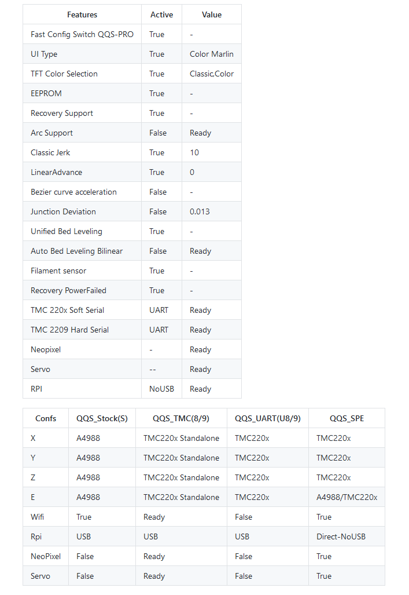
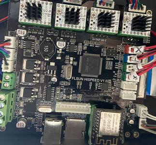
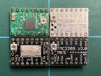
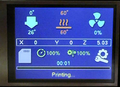
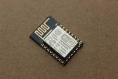
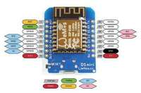
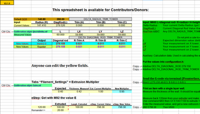

# 1. Marlin 3D Printer Firmware for Delta QQS-Pro and Q5.

  
  
  
  

  [**Group FaceBook**](https://www.facebook.com/groups/120961628750040)

  [**My Posts on Group FB**](https://www.facebook.com/hashtag/deltafoxies/?__gid__=120961628750040)

  

  __Not for production use. Use with caution!__

  - [1.Title](#1-Marlin-3D-Printer-Firmware-for-Delta-QQS-Pro-and-Q5.)
    - [1.1. Last News](#11-Last-news-Marlin-2.0-Bugfix-Branch.)
    - [1.2. Capabilities](#12-Validate-and-Actived-parts.)
    - [1.3. Hardware](#13-Hardware-for-the-FLSunQ-printers.)
    - [1.4. Example and Caption](#14-CAPTION.)
  - [2. Delta preparation](#2-SETTINGS-THE-PRINTER.)
    - [2.1. Delta Calibration](#21-Delta-Calibration.)
    - [2.2. Set the OffSet (Z)](#22-Z_OffSet.)
    - [2.3. Levelling (UBL)](#23-Bed-Levelling.)
    - [2.4. Refine your printed object dimensions.](#24-DIMENSIONS.)
    - [2.5. Perform a PID](#25-PID.[Proportional-Integral-Derivative](https://reprap.org/wiki/PID_Tuning))
    - [2.6. Adjust your Extruder](#26-EXTRUDER.)
  - [3. The slicer](#3-SLICER-PART.)

# 1.1. Last news Marlin 2.0 Bugfix Branch.
  Update Marlin-BugFix 20210129
  - Last fix by Marlin,
  - New QQS_Config rename FLSUNQ_Config (QQSP & Q5)
  - Support QQSP/Q5 Stock, TMC and UART mode.
  * All QQSP features on Q5.
  - Choice UI Classic (Lcd) and Color (TFT)
  - Change BAUDSRATE at 250000
  - Update ReadMe.

# 1.2. Validate and Actived parts.
 Validate:
  - Firmware for QQS-Pro with A4988/TMC220x_Standalone/TMC220x_UART/TMC2209_UART one-wire.

 With activate parts: 

  * [PID_EDIT_MENU]
  * [DELTA_CALIBRATION_MENU]
  * [MULTI_BUILD_MESH]
  * [POWER_LOSS_RECOVERY]
  * [FILAMENT_RUNOUT_SENSOR]
  * [AUTO_BED_LEVELING_UBL]
  * [BABYSTEPPING]
  * [PAUSE_BEFORE_DEPLOY_STOW]
  * [LIN_ADVANCE]
  * [ARC_SUPPORT]
  * [BINARY_FILE_TRANSFER]
  * [UART_MODE_for_TMC/RPI/ESP]

# 1.3. **Hardware for the FLSunQ printers.**
  
  * MotherBoards QQS: 
    [HiSpeedv1_&_RobinMini](./HISPEED)
    
    With integrated stepper drivers(A4988)=>(Sxxx-Robin_mini.bin)

    
    
    With removable stepper drivers.
    2&3_A4988(Green/Red)=>(Sxxx-Robin_mini.bin)
    
     
    
    4xTMC2208 MKS =>(8xxx-Robin_mini.bin)
    
    
  
  * Others Micro Steppinp Drivers
  
    

  * Other MotherBoards for Q5 and QQS:

    [NANOv1.2](./NANO)

    
    
    [SKR](./SKR)
    
    

  Typically the probe for the QQS-Pro printers.
  
  * Z Probe Offset (-16.2mm)

    
  
  * TFT screen color Marlin

    

  Optionals:

  * Modules Wifi
  
    
    

  * Led Strip with additional converter 24v/12-5v
  
    

  No validate:
  -TMC5121

# 1.4. CAPTION.

  **Exemple:** 
  8CWBL-Name_Of_Firmware.bin =>  (8)TMC2208 standalone - (C)UI Marlin - (W)Module Wifi - (B)Extruder BMG - (L)LinearAdvance  

  **Note**: After choosing your binary, remove the "8CWBL-" header or rename the file to "Robin_mini.bin" for QQS or "Robin_nano.bin" for Q5,
  place it on your SD card, insert your SD card into the printer and power on your printer.

  **Caption:**

  ### /*------Drivers--------*/
  - (S) A4988 (green/red)
  - (8) TMC2208 Standalone
  - (9) TMC2209 Standalone
  - (U8) TMC2208_UART with no module ESP12.
  - (U9) TMC2209_UART with no module ESP12.
  - (U8+) TMC2208 (XYZ) + Choice for E0 (A4988,TMC220x) 
  - (U9+) TMC2209 (XYZ) + Choice for E0 (A4988,TMC220x)
  - **(UH) TMC2209_UART with one wire (option modules Wifi/Rpi/Neopixel)**
  ### /*-------Options UI TFT--------*/
  - (F) UI STANDARD (Emulation LCD screen on TFT)
  - (C) UI MARLIN (TFT Color screen)
  ### /*------Modules--------*/
  - (N) NeoPixel (management of led strips)
  - (W) Module ESP8266/ESP12 (infos at the middle of the page)
  - (T) Extruder Titan
  - (B) Extruder BMG
  - (b) Extruder BMG mini
  ### /*-------Others options in firmware----*/ 
  - (A) BED_LEVELING_BILINEAR
  - (U) BED_LEVELING_UBL
  - (P) PreHeat bed before leveling
  - (R) ARC_SUPPORT
  - (L) Linear Advance (Possible Bug with BabyStep and TMC2208)
  ### /*-------Others options for advanced users who build their firmware----*/
  - HOST_ACTION_COMMANDS (Action Command Prompt support Message on OctoPrint) 
  - MEATPACK (Improve dialogue/communication with OctoPrint)
  - BINARY_FILE_TRANSFER
  - TEMP_SENSOR_0 (After changed the thermitor nozzle)
  - LCD_LANGUAGE (Change to the native language)
  - etc 
  ### /*-------Others Firmwares for Q5 nanov1.2 or QQS with SKR family or Mks_Nano Family----*/
  - (Q5_8+SCWTULR-Robin_nano35)   Q5 Stock(3xTMC2208+1xA4988). 
  - (Q5_9CWTULR-Robin_nano35)     Q5 with 4xTMC2209.
  - (QQS)U9rTULR16-SKR14_firmware QQS with SKRv1.4 Board with emulation LCD (Marlin Mode)

# 2. SETTINGS THE PRINTER. 
  
  ## HELP - PROCEDURE - TIPS 
  After the flash, you must **RESET** your printer!!
  - By menu: "Configuration/AdvancedSettings/InitializeEEPROM"
  - By terminal: M502, then M501 and M500.
  
  Now ready to start a calibration.
  
# 2.1. Delta Calibration.
  **Perform a Delta Calibration:**
  - By menu: "Configuration/Delta_Calibration/AutoCalibration"
  - by terminal: G33 or G33 V3 (5/8 iterations).
    
  **Tip** (Via a terminal like Pronterface, Octoprint, Repetier, Astroprint, ESP3D, ...): 
        
        After a Delta calibration (G33 v3) if you get a "std dev:" sup.> 0.2, 
        it means that you have a problem with the structure of your printer!
        A "std dev:" of 0.04 and less is excellent !! standard is 0.08.
  
  After removing the probe, you need to redo/adjust the Z offset (Space between the nozzle and the bed=Real dimension of your probe).
  
# 2.2. Z_OffSet.
  **Perform a Z offset:**
  - By menu: "Motion/MoveAxis" deactived the endstops.
    Then lower the nozzle slowly to adjust to a sheet of paper.
    View the value on the display and enter the value in the Configuration/ProbeZOffset" (Value between -17.00 and -13.00) and finally store the parameters "Configuration/StoreSettings".
  - By terminal: deactivating the endstops with command M211 S0 =>read result in console.
    View the value on the display and enter the value in the Probe_Z_Offset with command "M851 Z-xx.xx" and finally store the parameters with command "M500".
    Control your result of opérations by command "M503".
  Through a terminal,

# 2.3. Bed Levelling.
  **Perform a bed calibration ([**UBL**](https://marlinfw.org/docs/features/unified_bed_leveling.html)) with this commands via terminal:**
  - M190 S60 (temp bed at 60° or other)
  - G28 (autohome)
  - G29 P1 (automated probing of the bed)
  - G29 P3 T (Repeat until all mesh points are filled in)
  - G29 P3 T (bis)
  - G29 T (View the Z compensation values)
  - G29 S0 (Save UBL mesh points to EEPROM in the default location 0 )
  - G29 F10 (Set Fade Height for correction at 10 mm)
  - G29 A (Activate the UBL System)
  - M500 (Save to EEPROM)
  - M140 S0 (Stop temp bed)
  
  **Bed calibration ([**UBL**](https://marlinfw.org/docs/features/unified_bed_leveling.html)) via Menu**
  - Put your bed at working temperature.
  - Enter Motion/UnifiedBedLeveling/UBL Tools/Build Mesh/BuildColdMesh to run a levelling.

  
  **TIPS-LEVELLING**

    - You have 4 locations: so you can save (G29 Sx) different meshes at different bed temperature
     (ie: 1 for PLA, 2 for PETG, 3 for FLEX, etc. ) and call them back 
     when you slice from the PLA by command G29 L1 in the startGCode* of your filament.
     (*=PrusaSlicer).

    - If you later notice that the dimensions of your printed objects are inaccurate then 
    it will be necessary to carry out a final calibration of your turns by printing an object
    to correct these errors.

# 2.4. DIMENSIONS.
  **Perform or correct by calculation (worksheet) the adjustment of your dimensions:**
  - To adjust the x, y, z precision, you first need a well-stabilized machine, 
  - ie being able to print on a well-leveled plate. Then by printing this model: [Advanced Delta Printer Calibration](https://www.thingiverse.com/thing:745523)
  - you adjust the DELTA_DIAGONAL_ROD (L) and the lengths DIAGONAL_ROD_TRIM_TOWER (ABC) between the laps by calculation (xls or odt file) and you insert them all the parameters to be modified with this command [M665](https://marlinfw.org/docs/gcode/M665.html) Lxx Axx Bxx Cxx.

  

  - If you print the model again you should find a very small difference (0.1/0.09) on XYZ.
  - I prefer this model because it fits well with the caliper.[QuickCalDelta](https://www.thingiverse.com/thing:2256557)

  
  Remember to adjust your temperatures by doing your **Nozzle PID** and adjust your **eSteps** for stable filament flow.
  
# 2.5. PID.[Proportional-Integral-Derivative](https://reprap.org/wiki/PID_Tuning)
  
  **Perform a nozzle PID:**
  - by the menu: "Configuration/Advanced Settings/Temperature/PID Autotune E1" and choose your current working temperature (ie: PLA 210, PETG 230, ABS 250) 
  - by terminal: with the command "M303 E0 **S210** C8 U0" (ie: S210 for PLA)
  
  **Perform a bed PID:**
  - by menu: "Configuration/Advanced Settings/Temperature/PID Autotune Bed" and choose your current working temperature (ie: PLA 60, PETG 80, ABS 90)  
  - by terminal: with the command "M303 E-1 **S60** C8 U" (ie: S60 for PLA)
  
# 2.6. EXTRUDER.
  **Perform correct adjustment of the steps of your extruder.**
  - ie: For the BMG, I set it to 415 but it is better to confirm it by ordering M83 then G1 E100 F100 which extrudes 100mm of filament.
  - You remove your filament, the Capricorn tube coming out of the extruder, introduce the filament into the extruder so that it comes out on the other side. 
  - Measure before extruding 120mm of filament to make a mark.
  - Heat your nozzle to 190°C and run the previous command. At the end, measure your remainder up to the mark and do rule of three:
  - LengthtoExtrude / LengthExtruded * Actuel_eStep (M92 E_old) = New_eStep (M92 E_new).
    
  **Perform correct filament flow.**
  - This chapter is being written ...............
  
# 3. SLICER PART.

  **TIPS-SLICER** 
  
    In your **Start_GCode** on your Slicer.
    - M420 S1 enable bed leveling but in my firmware G28 activate the last mesh used or the default one (0)
    - M420 Lx or G29 Lx(Load mesh_x correction). If you are using PrusaSlicer you can add a line
     "G29 Lx; load mesh PLA" in the starting GCode instead instead of the G29 Lx in the printer start GCode.

  And on my **EndGCode** I remove G28 and I substitute with this type of code:

        {if layer_z <max_print_height} G1 Z {min (layer_z + 100, max_print_height)} {endif} F4000

  This works fine in [PrusaSlicer](https://help.prusa3d.com/en/article/macros_1775) and goes 100cm above the finished object. It's up to you to adapt it for your favorite Slicer or to improve mine.

  ## **You will find some Slicer profiles in the "Slicers" [directory](../Slicers).** 

  # For the firmware Wifi Module, go to ESP3DV2 [directory](./ESP3DV2):

Enjoy and support my work ....🙃

 ## Support my work

  This QQS-Pro porting project for the Marlin firmware was only possible thanks to its supporters, you can participate via
   
   
   
   
   
   

  You can also send me a tip via [Thingiverse](https://www.thingiverse.com/FamStel/about) if you prefer.

 Massive thank you in advance :heart:

# Version history

## Marlin 2.0 Bugfix Branch
 Update Marlin-BugFix 20210117
  - Last fix by Marlin,
  - Fix PID Range to 30,
  - add Preheat before leveling.
  - New core for SKR14 and SKR14T (Ready TFT host)

## Marlin 2.0 Bugfix Branch
 Update Marlin-BugFix 20210109
  - Last fix by Marlin,
  - Fix Feedback Users,
  - Reduction of the hysteresis range from 10 to 6,
  - 4 Mesh Locations,
  - Functions disable but enable by menu (Runout, PowerLoss),
  - **New_Core** size reduction (Small Boot Logo) and build optimization,
  - Fix PowerLoss,
  - Fix SDCard corrupted,
  - Fix for "Mesh Edit",
  - New test firmwares for Q5 (Stock and TMC2209).
  - Special firmware for supporters and developments.

## Marlin 2.0 Bugfix Branch
 Update Marlin-BugFix 20201223
  - News directory by Boards (HISPEED, NANO, SKR)
  - Last fix by Marlin,
  - Fix Feedback Users(Fan, CalDelta, Accel,...)
  - **FIX New_Core** size reduction and build optimization,
  - Some optimisation moves/accel printing, Calibration UBL, Standard Home, etc**
  - No fix for "Mesh Edit".

## Marlin 2.0 Bugfix Branch
 Update Marlin-BugFix 20201213 
  - Last fix by Marlin,
  - **New_Core** size reduction and build optimization,
  - Some optimisation moves/accel printing, Calibration UBL, Standard Home, etc**
  - No fix for "Mesh Edit".
  - Validate Connecttion Rpi/OctoPi direct (No_USB).

 Update Marlin-BugFix 20201120
  - Last fix by feedback users.
  - **News Firmwares with optimisation moves/accel printing, Calibration UBL, Standard Home, etc**
  - Validate TMC2209 modes.
  - Validate Module Wifi ESP8266/ESP12 [Firmware ESP3Dv2](https://github.com/luc-github/ESP3D/wiki/Install-Instructions)

 Update Marlin-BugFix 20201030
  - Last correction for Black screen in UI Color
  - Correction thermal protection hysterisis.
  - Enable mode TMC220x UART SoftSerial
  - Add comments into definition_pins file.

 Update Marlin-BugFix 20201022
  - Integration in the Marlin firmware of the HISPEED motherboard and configuration files for the QQS-Pro.
  - Fixed Deploy/Stow ZProbe
  - Fixed for users using E3Dv6 hotend
  - Others TIPS(QQS_Config.h, Quick calibration 6, Menu management of NeoPixel leds, etc).

## Marlin 2.0.7 
 Update 2020-10-01
 
## Marlin 2.0 Bugfix Branch
 Update Marlin-BugFix 20200905

